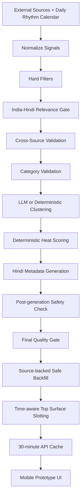

# ShareChat Trending Tags System — APM Assignment

Mobile-first prototype + live Hindi trending-tags API for ShareChat’s APM case study.

## Submission links

- **Hosted Prototype:** `[add-your-vercel-url]`
- **GitHub Repo:** `[add-your-github-repo-url]`
- **Loom Walkthrough:** `[add-your-loom-url]`
- **Recent Invocation Screenshot:** attach one current screenshot during submission

## What I built

1. **Trending Tags System** — `GET /api/trends` returns ranked Hindi tags with description, category, heat score, sources, safety status, and “why trending” metadata.
2. **Clickable App Prototype** — `/` renders a ShareChat-like mobile feed. Users can tap a tag and open a trend detail sheet with heat, category, source attribution, and summary.

The app does **not** use static build-time trend payloads. It fetches current sources at runtime and applies a 30-minute server cache.

## Product insight

ShareChat trends are time-aware social presence, not just “internet trends.” Observed live ShareChat tags:

**Morning around 7 AM**

```text
🌷 शुभ रविवार
🙏 माँ वैष्णो देवी
📡 विश्व दूरसंचार दिवस 😊
🌅 गर्मी में धूप से बचने के उपाय 🥵🌞
```

**Midday around 12 PM**

```text
🦠 इबोला वायरस से 80 लोगों की मौत 😢
🚆 राजधानी एक्सप्रेस में लगी भीषण आग 🔥
⛽ CNG की कीमतों में लगी आग 😲
📢 CM विजय से मिले कमल हासन 🤝
```

So the system answers: what are Hindi-speaking Bharat users greeting with, praying about, reacting to, worrying about, searching for, and sharing **right now**?

## API

- `GET /api/trends`
  - `limit`: default `10`, min `10`, max `20`
  - `forceRefresh=1` or `true`: bypasses the 30-minute runtime cache
  - `debug=1` or `true`: includes source health, intermediate counts, rejection counts, pipeline order, and per-trend scoring details
- `GET /api/trends/health`
  - cache status
  - source configs
  - last source health
  - optional key presence only; never exposes key values

Both routes are dynamic Node.js runtime routes:

```ts
export const dynamic = "force-dynamic";
export const revalidate = 0;
export const runtime = "nodejs";
```

## Pipeline order

The code follows the assignment pipeline exactly:

1. External Sources
2. Normalize Signals
3. Hard Filters
4. India-Hindi Relevance Gate: Regional > Global
5. Cross-Source Validation
6. Category Validation
7. LLM Clustering
8. Deterministic Heat Scoring
9. LLM Hindi Metadata Generation
10. Post-generation Safety Check
11. Safe Backfill if fewer than 10 tags
12. Short API Cache
13. Trending Tags API

The LLM is optional and **never ranks**. Ranking is deterministic and auditable via `debug=1`.

## Source stack

Core sources are config-driven in `src/lib/trends/source-config.ts`:

- Google Trends India RSS
- Dainik Bhaskar RSS
- Amar Ujala RSS
- NDTV Hindi RSS
- India TV / Hindustan Times / The Hindu RSS for national validation
- RBI RSS feeds
- wttr.in city weather JSON as a no-key weather proxy
- SACHET / NDMA CAP Feed
- YouTube Data API v3, when `YOUTUBE_API_KEY` exists
- Calendarific, when `CALENDARIFIC_API_KEY` exists, plus `src/data/indian-festivals.json`

Optional experimental/extension sources:

- Dainik Jagran, Live Hindustan, News18 Hindi, and PIB Hindi are present in config but disabled because their public feeds currently return HTTP 500/503/403 in this environment. This keeps debug output clean instead of repeatedly reporting known publisher blocks.
- Reddit public JSON is disabled because it frequently requires OAuth; it remains documented for future OAuth integration and is never sufficient alone.
- Roanuz placeholder for live cricket facts when account-specific endpoint details are available

## Environment variables

All keys are optional. The API degrades gracefully when they are missing.

```env
ANTHROPIC_API_KEY=optional_but_recommended
YOUTUBE_API_KEY=optional
CALENDARIFIC_API_KEY=optional
ROANUZ_API_KEY=optional
REDDIT_CLIENT_ID=optional
REDDIT_CLIENT_SECRET=optional
NEXT_PUBLIC_TRENDS_API_BASE_URL=optional_public_backend_origin
TRENDS_ALLOWED_ORIGIN=optional_public_frontend_origin
```

When keys are missing:

- no Anthropic key → deterministic clustering/metadata fallback
- no YouTube key → YouTube is skipped
- no Calendarific key → internal Bharat festival JSON still works
- no Roanuz key → no live cricket facts are generated or invented
- no Reddit OAuth → only low-weight public JSON demo fetch is attempted; Reddit alone is blocked

Frontend/backend deployment:

- For the normal Vercel deployment, leave `NEXT_PUBLIC_TRENDS_API_BASE_URL` empty. The prototype calls the same app's `/api/trends` route.
- If the frontend is deployed separately from the backend, set `NEXT_PUBLIC_TRENDS_API_BASE_URL=https://your-backend-domain.vercel.app` on the frontend project.
- If the backend is called from a separate public frontend origin, set `TRENDS_ALLOWED_ORIGIN=https://your-frontend-domain.vercel.app` on the backend project. If unset, the API allows public GET access with `*`.

## Cache

The runtime in-memory cache is 30 minutes. The API response includes the required cache note:

> The 30-minute cache window is not arbitrary. During research, I observed ShareChat's own trending feed directly — only 2 of 4 tags changed over a 30-minute window. Trends do not move second-by-second. The cache matches the actual refresh cadence of the product I am trying to improve.

## Production ranking path

Prototype ranking uses external validation because ShareChat internal behaviour is unavailable. In production, ShareChat internal signals should become the primary ranker:

- searches
- posts
- shares
- comments
- watch time
- tag taps
- creator velocity
- content inventory

Important success metrics are surfaced in API assumptions/debug: trend CTR, post-tap watch time, detail-page dwell time, content creation from tag, language-match rate, hide/report rate, and duplicate rate. Language-match rate is critical because ShareChat is language-first, not just India-first.

## Run locally

```bash
npm install
npm run dev
```

Open:

```text
http://localhost:3000/api/trends
http://localhost:3000/api/trends?forceRefresh=1&debug=1
http://localhost:3000/api/trends/health
```

Validate:

```bash
npm run typecheck
npm run test
npm run build
```

## How the system decides what is trending

Prototype scoring uses external validation because ShareChat internal data is unavailable:

```text
Heat Score = live external validation + search/video demand + ShareChat intent proxy
           + cultural/daily-rhythm/utility impact + freshness/time fit
           - safety, spam, fatigue, duplicate, and quality penalties
```

In production, ShareChat internal demand should become primary: in-app searches, post velocity, shares, comments, watch time, tag taps, creator velocity, content inventory, hide/report rate, and duplicate rate.

## Workflow diagram



## UX rationale

- Four primary trend rows mirror the observed ShareChat mobile surface.
- Hindi-first display labels optimize scan speed and cultural familiarity.
- Tapping a trend opens a detail sheet instead of a plain list page.
- Heat/category/source evidence is shown in detail, not cluttering the feed.
- Time-aware slotting prevents all-devotion in live periods and all-news in morning rhythm.

Rejected: desktop dashboard, static mock list, LLM-only ranking, all-news output, all-devotion output, and generic tags with no source evidence.

## Quality controls

The final API rejects publisher names, raw headline fragments, malformed mixed-language tags, Reddit-only trends, unsafe/review-required items, generic placeholders, and mismatched fields such as `#RBI_रेपो_रेट` with `IPL 2026`.

Daily rhythm tags are timestamped signals from a documented calendar layer. They stand in for ShareChat internal posting/tag-tap rhythm until internal data is available; they are not static build-time payloads.

## What I would build next with 4 more weeks

1. Integrate ShareChat internal event streams and content inventory checks.
2. Add state/city/language-level surfaces beyond Hindi national.
3. Build editorial tools for suppress/boost/merge and sensitive trend review.
4. A/B test top-surface mix, cache cadence, and heat-score weights.

Success metrics: trend CTR, post-tap watch time, detail-page dwell time, content creation from tag, language-match rate, hide/report rate, duplicate rate, content inventory satisfaction, and hourly freshness match.
