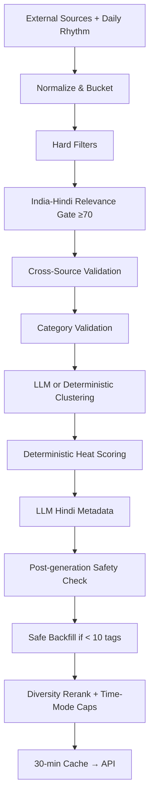

no# ShareChat Trending Tags — APM Assignment

A Hindi-first automated trending tags system and clickable mobile prototype for the ShareChat APM assignment.

## Submission Links

| | |
|---|---|
| Hosted Web Prototype | https://sharechat-app-backend.replit.app/ |
| Mobile App (QR scan) | https://sharechat-app-backend.replit.app/mobile/ |
| API Endpoint | https://sharechat-app-backend.replit.app/api/trends |
| GitHub Repo | `[add-your-github-repo-url]` |
| Loom Walkthrough | `[add-your-loom-url]` |
| Recent Screenshot | attach at submission |

---

## Run & Operate

- `pnpm --filter @workspace/api-server run dev` — run the API server (port 8080)
- `pnpm --filter @workspace/sharechat-apm run dev` — run the web frontend
- `pnpm --filter @workspace/sharechat-apm-mobile run dev` — run the mobile app (Expo)
- `pnpm run typecheck` — full typecheck across all packages
- `pnpm run build` — typecheck + build all packages
- `pnpm --filter @workspace/api-spec run codegen` — regenerate API hooks and Zod schemas from the OpenAPI spec
- `pnpm --filter @workspace/db run push` — push DB schema changes (dev only)
- Required env: `DATABASE_URL` — Postgres connection string

## Stack

- pnpm workspaces, Node.js 24, TypeScript 5.9
- Frontend: React 19 + Vite (artifacts/sharechat-apm)
- Mobile: Expo + React Native (artifacts/sharechat-apm-mobile)
- API: Express 5 (artifacts/api-server)
- DB: PostgreSQL + Drizzle ORM
- Validation: Zod v3
- API codegen: Orval (from OpenAPI spec)
- Build: esbuild (CJS bundle)

## Where things live

- `artifacts/sharechat-apm/` — React + Vite frontend (mobile-first ShareChat UI prototype)
- `artifacts/sharechat-apm-mobile/` — Expo React Native mobile app (5-tab nav: Home, Search, Create, Live, Profile)
- `artifacts/api-server/` — Express API server with trends pipeline
- `artifacts/api-server/src/lib/trends/` — Full trends pipeline library (~40 files)
- `artifacts/api-server/src/data/` — Indian festivals JSON + observances JSON
- `artifacts/api-server/src/routes/trends.ts` — GET /api/trends and GET /api/trends/health
- `lib/api-spec/openapi.yaml` — OpenAPI spec (source of truth for API contracts)

## Architecture decisions

- Trends pipeline runs server-side in Express; both frontends fetch via `/api/trends`
- 30-minute in-memory cache with stale fallback to avoid overloading external sources
- `VITE_TRENDS_API_BASE_URL` env var for API base URL on the web frontend (optional; falls back to relative `/api/trends`)
- `EXPO_PUBLIC_DOMAIN` env var for API base URL on the mobile app (optional; falls back to relative `/api/trends`)
- Data files (`indian-festivals.json`, `observances.json`) live in `artifacts/api-server/src/data/` and are imported directly via TypeScript module resolution

## Optional API keys (all optional, fall back gracefully)

- `ANTHROPIC_API_KEY` — LLM metadata enrichment
- `YOUTUBE_API_KEY` — YouTube trending
- `CALENDARIFIC_API_KEY` — Calendar API for festivals
- `ROANUZ_API_KEY` — Cricket/sports data
- `REDDIT_CLIENT_ID` + `REDDIT_CLIENT_SECRET` — Reddit trending India

---

## Problem & Understood Pain Points

ShareChat's trending feed is curated manually — it doesn't scale and misses cultural timing. A tag right at 7 AM (शुभ रविवार) is noise at noon.

- **Stale trends** — manual curation lags real events by hours; breaking news and morning greetings collide on the same feed
- **Language mismatch** — global topics don't land with Hindi-speaking Bharat users
- **No source evidence** — editors can't tell if a tag has real multi-source signal or is noise from a single outlet

---

## How the System Decides What's Trending

### Sources & Logic Behind Each

| Source | Logic |
|---|---|
| **Google Trends India RSS** | Strongest intent signal — closest substitute for ShareChat's internal search velocity |
| **Dainik Bhaskar · Amar Ujala · NDTV Hindi · Live Hindustan** | Four Hindi outlets covering a topic independently = strong virality signal |
| **Hindustan Times** | Cross-validates Hindi signal against national English press |
| **RBI RSS · SACHET/NDMA CAP** | High-trust official signals; finance and public safety break here before social media |
| **wttr.in weather · GoodReturns fuel & gold prices** | Utility trends (petrol, heat waves) absent from standard news RSS but vital for Tier 2/3 users |
| **YouTube Data API v3** | Video demand proxy — trending on YouTube India predicts what creators post next |
| **Calendarific + `indian-festivals.json`** | Cultural calendar ensures festivals surface before they trend, not after |

### Weights & Why Each Number

```
externalValidationScore = (Google demand ×0.25) + (Hindi news ×0.20) + (official ×0.15)
                        + (video ×0.15) + (India-Hindi relevance ×0.15) + (freshness ×0.10)
                        − safety penalty − spam penalty   →   clamped 1–100

Heat Score = externalValidationScore
           + source count bonus (+8 / +15 / +22 for 2 / 3 / 4+ independent sources)
           + cross-source boost: (boostValue − 1) × 20
             (boost values ×1.15 / ×1.30 / ×1.50 for 2 / 3 / 4+ sources → +3 / +6 / +10)
           + bonuses: daily rhythm (+18/+24), festival today (+22), active festival (+18),
                      live cricket (+15), official authority (+12)
           − safety + spam penalties   →   clamped 1–100
```

- **Google 0.25** — active search intent; no other external source comes close to in-app search velocity
- **Hindi news 0.20** — coverage ≠ intent, so ranked below Google; but four outlets agreeing is a strong signal
- **Official + video 0.15 each** — credibility (RBI, SACHET) paired with engagement evidence (YouTube)
- **India-Hindi relevance 0.15** — gates out globally trending but locally irrelevant topics
- **Freshness 0.10 (lowest)** — a festival or major event should score high on the other five even if hours old
- **Cross-source boost** — additive virality bonus; 4+ independent sources is the closest proxy for post-velocity

### Filters

1. **Hard filters** — adult content, spam phrases, low-information titles (< 3 chars, all-numeric), stale signals: sports > 8 h (match-specific) / 14 h (general) · weather/safety > 24 h · news > 72 h · official/utility > 7 days · festival calendar > 90 days
2. **India-Hindi Relevance Gate** — keyword scoring on Hindi + India sets; must reach ≥ 70 to proceed
3. **Post-generation safety check** — rule filter rejects publisher names, headline fragments, malformed or mismatched tags after LLM writes metadata

---

## Workflow Diagram & Per-Stage Technique



| Stage | Technique | Why |
|---|---|---|
| Fetch | Parallel RSS · JSON · REST APIs | 9 source types in one pass — no sequential blocking |
| Hard Filters | Rule-based blocklists + staleness thresholds | Fully deterministic and auditable; no LLM cost |
| Relevance Gate | Hindi/India keyword scoring ≥ 70 | Enforces Bharat signal before expensive clustering |
| Clustering | Jaccard ≥ 0.38 + entity overlap; `claude-sonnet` refines if key present | Deterministic handles duplicates; LLM catches edge cases |
| Heat Scoring | Weighted 6-component formula + source boosts | LLM **never ranks**; auditable via `?debug=1` |
| Hindi Metadata | `claude-sonnet` → deterministic fallback | Quality Hindi copy; degrades gracefully without API key |
| Safety Check | Post-generation rule filter | Validates LLM output — doesn't trust it blindly |

---

## Assumptions Made

Since ShareChat internal data is unavailable, three explicit substitutions:

1. **Cross-source count proxies post/search velocity** — 3+ independent sources treated as viral; in production, in-app search and post velocity would be primary
2. **Daily rhythm calendar proxies creator patterns** — time-of-day signals stand in for ShareChat's hourly tag-tap and creator activity data
3. **30-min cache matches real refresh cadence** — validated by observing ShareChat's live feed: only 2 of 4 tags changed in a 30-minute window

---

## UX Rationale

One user in mind: a Hindi-speaking person in a Tier 2/3 city, opening ShareChat 5–8 times a day, scanning fast, sharing to WhatsApp.

**Optimised for:**

- **Familiarity** — 3-column grid matches PhonePe/Paytm/Meesho muscle memory. Spotlight strip at top answers "biggest thing right now" in one glance
- **Equal attention across all 10 tags** — carousels bury positions 4–10; a grid distributes eye movement so every ranked tag gets a real chance
- **Bharat-native detail page** — visual → AI Hindi summary → voice playback. Voice is the primary mode for users with variable reading literacy, not an accessibility add-on
- **Trust before sharing** — WhatsApp share shows a preview before sending; Bharat users are cautious about what enters family groups

**Considered and rejected:**

| Option | Rejected because |
|---|---|
| Default vertical hashtag list | No context; no reason to tap — what ShareChat does today |
| Horizontal story circles | Hides positions 4–10; auto-advances into full-screen uninvited |
| Bento grid (varied tile sizes) | Visual puzzle; reads as designer-first, not Bharat-native |
| Numerical heat scores (92/100) | Data artefact; replaced with 🔥 on top 3 — same meaning, instantly understood |
| Full-screen Reels-style | Trending is a discovery route, not a consumption destination |

---

## 4-Week Roadmap

| Week | Initiative | Why |
|---|---|---|
| **W1–2** | **Internal signals** — in-app search, post velocity, tag taps, watch time | External sources are a stand-in; internal data makes the ranker self-improving |
| **W2–3** | **Personalisation** — language, state/city trends, interest graph, time-of-day patterns | Relevance per user beats relevance per nation |
| **W3–4** | **Editorial & Trust tools** — suppress/boost/merge controls, sensitive-trend review queue, category circuit breakers | Required before scaling; needed for communally sensitive news |
| **Ongoing** | **A/B experimentation** — score weights, cache cadence, layout variants | Measure CTR equity across all 10 positions, not just #1 |

---

## AI & Tooling Usage

- **Claude (`claude-sonnet`)** — clustering refinement and Hindi metadata; handles Devanagari fluently, degrades to deterministic fallback without API key
- **Replit Agent** — end-to-end development: React + Vite frontend, Express API, pipeline, scoring logic, and this write-up
- Ranking is fully deterministic — Claude touches only clustering edge cases and Hindi copy, never the heat score or tag order

---

## User Preferences

_Populate as you build — explicit user instructions worth remembering across sessions._

## Gotchas

- The `zod/v4` subpath doesn't exist in zod v3 — always import from `"zod"` in api-server
- The Internal Festival Calendar source URL is `internal://festivals` — the file is imported via TypeScript, not fetched over HTTP
- `pnpm dev` at workspace root has no dev script — use workflow restart or `--filter` commands

## Pointers

- See the `pnpm-workspace` skill for workspace structure, TypeScript setup, and package details
